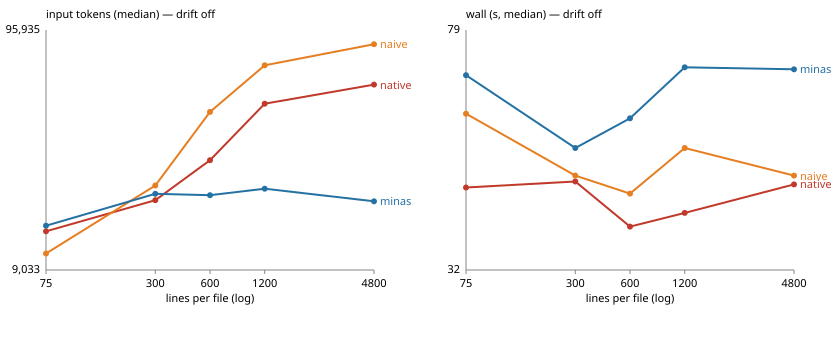
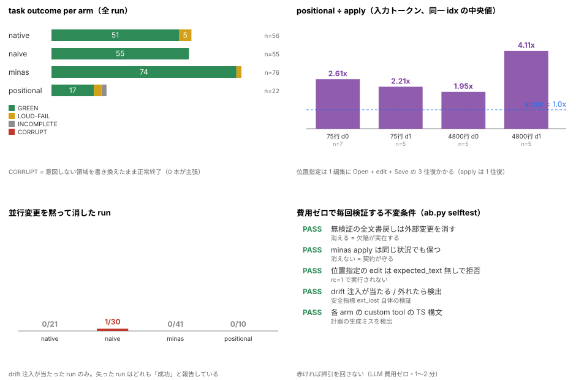

# mina

> An editor built for agents to drive. A resident daemon owns the editor state — documents, undo, LSP — and agents edit through a session contract (verified, content-addressed edits) instead of rewriting files; every frontend — the headless `minas` session CLI an agent calls, or the optional TUI a human uses — is just a client.

**mina** = **min**imize cost for AI **a**gent — a cost-minimizing agent editor. By suffix: mina**e** = editor (the TUI), mina**d** = daemon, mina**s** = session (the headless CLI).

[English] · [日本語](./README.ja.md)

**Two measured effects** (details and raw data in [docs/benchmarks/l2/](docs/benchmarks/l2/README.md), figures below):

1. **Cost stops growing with file size.** On a task with 4,800 lines per file, input tokens are **−79%** and cost **−61%** versus naive full-file tooling (medians). Naive tooling grows with the file; minas stays roughly flat. The two curves cross at 300–600 lines per file.
2. **External changes are not silently discarded.** In an experiment that injects a concurrent external write to the file being edited, **only 1 of 209 runs** lost that change — and that one was the whole-file-rewrite arm; minas's two edit paths scored **0/51**. The failure mode's existence itself is re-verified by a deterministic, LLM-free test on every run.

---

## Getting started

```console
# 1. daemon + session CLI. Agent-facing tools only; the TUI is separate
$ cargo install minad minas

# 2. Language servers are not bundled — install the ones for your languages
$ rustup component add rust-analyzer
$ npm install -g typescript-language-server typescript

# 3. See what was found: the daemon generation + configured servers
$ minas info
```

The daemon starts on demand from the first client; run `minad serve` to keep it resident. Language servers are started per workspace root, so `symbol` / `rename` / `check` work as soon as they are on `PATH`. tree-sitter syntax highlighting works out of the box. You can also build from source with `cargo build --release`.

### A first session

```console
$ minas outline src/lib.rs              # structure without reading the file
$ minas read src/lib.rs --lines 40:60   # only the numbered lines you need
$ minas apply src/lib.rs "old" "new"    # verified edit (rejected with a reason if stale)
$ minas check src/lib.rs                # LSP diagnostics — the build stays the final gate
$ minas rename src/lib.rs "USD" "JPY"   # workspace-wide semantic rename
```

`minas apply` identifies its target by **content, not position**. If the text is gone it fails instead of writing something else:

```console
$ minas apply a.rs "let x = 2;" "let x = 3;"
NOT FOUND: "let x = 2;"          # rc=2. The file is not modified.
```

Reading and editing need no configuration. Two optional files change behavior:

- `~/.config/minae/languages.toml` (`$XDG_CONFIG_HOME/minae/`, daemon side): add or override language servers. Merged over the embedded defaults and re-read when a server starts.
- `~/.config/minae/config.toml` (client side, TUI only): `colorscheme` and `agent_command` (the agent the TUI launches from review comments). User colorschemes live in `~/.config/minae/colorschemes/` as TOML.

### Getting agents to use minas

`minas skill` is pull-based: an agent that does not know minas exists will never call it. Hand the trigger to wherever the agent reads instructions, once:

```console
$ minas skill --md > ~/.claude/skills/minas/SKILL.md   # same for ~/.pi/agent/skills/minas/SKILL.md
$ minas skill --md >> AGENTS.md                         # or append straight into your repo instructions
```

The wrapper holds no copy of the shelf (it just says "run `minas skill`"), so it cannot rot as topics are added. If the stamp at the end of the file and `cli_generation` from `minas info` disagree, regenerate it. The TUI is `minae [file ...]`.

## What is mina

mina is a terminal editor with a daemon/client split, built for agent-driven editing first and interactive use second.

A resident **Daemon** holds all editor state — open documents, undo histories, selections, LSP sessions, detection of external changes. **Clients** (the headless `minas` CLI, an agent, or the optional TUI) connect over a local socket, send commands, and render state snapshots. Clients can come and go; the daemon and its state remain. Because every frontend speaks the same protocol, the tools an agent uses in a script are the same tools the TUI uses interactively — and the TUI is optional.

For an agent this has two important consequences: **edits are validated against the daemon's state**, and **external changes are detected and reloaded**. Both are the foundation of "does not silently break", measured in [Claim 2](#claim-2-it-does-not-silently-break).

## Capabilities

- **Editing core** (UI-agnostic): documents, selections, undo groups, Normal / Insert / Select modes, search, reload on external change
- **Language support via LSP** (per workspace root): diagnostics, inlay hints, definition peek, semantic rename / references
- **Language servers** (verified embedding per ADR-0030): `rust-analyzer` for Rust, `typescript-language-server` for TypeScript — plus tree-sitter grammars and highlight queries for the same two languages. Other LSPs can be added in the user's `languages.toml`
- **Headless agent interface**: `minas` (table below)
- **Terminal UI**: `minae` TUI (ratatui/crossterm, per-connection views)
- **Configurable**: `languages.toml` (daemon side), `config.toml` and user colorschemes (client side), and the built-in `minas skill` guides for agents

| Command | What it does |
| :-- | :-- |
| `read --lines a:b` / `--span` | Bounded numbered read. Does not read the whole file. |
| `apply <path> <old> <new>` | **Content-addressed**, verified edit (also `--whole` / `--hunks-stdin` / `--pair`) |
| `edit --path <p> <json>` | **Position-addressed** edit; `expected_text` is required (see below) |
| `check <path>` | Wait for diagnostics to settle and report (replaces `wait` + `get` + JSON parsing). Exit 2 on error diagnostics |
| `rename <path> <old> <new>` | Workspace-wide semantic rename (LSP) |
| `references` / `symbol` / `at` / `hover` | Semantic search and position resolution |
| `outline` / `hints` / `peek` | Structure, inlay hints, and definitions without reading the file |
| `wait <generation>` | Block until analysis advances (e.g. in-flight diagnostics) |
| `exec <command>` / `get` / `delete` / `search` | Raw protocol commands and state snapshots |
| `skill [topic]` | The agent-facing shelf (index → per-topic) |
| `info` / `review` / `help` | Daemon and config status, review comments, help |

Every command returns JSON. If an edit is rejected, re-read the range and retry — the rejection names what no longer matches.

---

## Claim 1: cost stops growing with file size



One fixed task (add a field to a two-file Rust crate, five edits) was run at five scales,
**varying only the line count** (padding with noise lines, so difficulty is unchanged). The three
arms share the same prompt, the same model, and the same runner; only the available tools differ:

| arm | Tools given |
| :-- | :-- |
| `native` | opencode's built-in read / edit / write / glob / grep (plus the internal `apply_patch`) |
| `naive` | Full-file read + unverified whole-file replace (the classic naive shim) |
| `minas` | Numbered range read + verified `apply` (minas's session contract) |
| `positional` | Numbered range read + position-addressed `edit` (minas's own second path; results below) |

None of the arms has a shell. Forcing shims through a shell does not hold: the model escapes to
`apply_patch` or `sed -n` and the comparison collapses (see [Method and reproduction](#method-and-reproduction)).
Compliance is judged by **the tools a run actually called**; a run that calls anything outside its
allow-list is not used as a measurement (209 runs adopted, 31 rejected).

### Input tokens and cost (medians, no injected drift)

| Total lines | Per file | native | naive | **minas** | minas / native | minas / naive |
| ---: | ---: | ---: | ---: | ---: | ---: | ---: |
| 150 | 75 | 13,226 | 10,627 | 13,973 | +3% | +1% |
| 600 | 300 | 17,950 | 20,749 | 19,130 | +8% | −4% |
| 1,200 | 600 | 26,619 | 42,827 | **18,859** | **−29%** | **−58%** |
| 2,400 | 1,200 | 46,428 | 67,799 | **20,106** | **−60%** | **−70%** |
| 9,600 | 4,800 | 56,036 | 83,422 | **17,770** | **−70%** | **−83%** |

Cost (median, USD) has the same shape: at 4,800 lines per file, **minas $0.0101** versus native
$0.0207 and naive $0.0257.

What it says:

- **minas's cost is nearly flat in scale** (14k → 17.8k, flat to slightly up): it reads only the ranges
  it needs. native and naive read whole files, so they grow with the line count.
- **The curves cross at 300–600 lines per file.** Below that, minas is the more expensive option
  (+3% at 150 lines). It is not a "always cheaper" tool; it pays off when **files are large**.
- At the largest scale: **−70% to −83% input, −51% to −61% cost**.

### Statistical strength (honestly)

| Comparison | Condition | n | Input delta | p (sign test) |
| :-- | :-- | ---: | ---: | ---: |
| minas / native | 4,800 lines/file | 10 | **−70%** | 0.002 |
| minas / naive | 4,800 lines/file | 5 | −83% | 0.062 |
| minas / naive | 4,800 lines/file + drift | 25 | **−84%** | **< 0.001** |
| minas / native | all scales pooled | 35 | **−33%** [−56%, −14%] | 0.002 |
| minas / naive | all scales pooled | 25 | −58% [−70%, −4%] | 0.015 |

(Ratios are medians of paired same-idx ratios; they differ slightly from ratios of the medians in the table above.)

At n=5 the sign test bottoms out at p=0.0625, so five runs per scale cannot be called significant on
their own (the n and minimum-detectable-effect calculations are in
[docs/benchmarks/l2/README.md](docs/benchmarks/l2/README.md)). That is why the 4,800-lines-per-file
cell was extended to 25 runs — the only place where **all 25 pairs point the same way** at p < 0.001.
Numbers depend on the model, runner and n, so read them as: **model opencode/gpt-5.4-nano, runner
opencode 1.18.31, debug build, 2026-09-16.**

## Claim 2: it does not silently break



Agent edits break in two ways. **Breaking loudly** (the build fails, the edit is rejected) is a cheap
failure. What is expensive is **breaking silently**: exit code 0, the agent says "done", the file is
wrong. That is mina's central claim, so each run was classified four ways:

| Class | Meaning |
| :-- | :-- |
| **GREEN** | All five intended edits landed and `cargo check` passes |
| **LOUD-FAIL** | The build broke, or verification rejected the work, and the run still ended — a loud (cheap) failure |
| **INCOMPLETE** | Part of the scope is unedited (no extraneous change) |
| **CORRUPT** | Exit code 0 and the agent claims success, while the **unintended region was modified** |

Result: **0 CORRUPT out of 209 adopted runs** (and 0 damaged noise lines). The breakdown:

| arm | n | GREEN | LOUD-FAIL | INCOMPLETE | CORRUPT |
| :-- | ---: | ---: | ---: | ---: | ---: |
| native | 56 | 51 | 5 | 0 | **0** |
| naive | 55 | 55 | 0 | 0 | **0** |
| minas | 76 | 74 | 2 | 0 | **0** |
| positional | 22 | 17 | 3 | 2 | **0** |

### It does not silently discard concurrent changes

This is the decisive part. While the agent was working, we injected an **external write to the same
file** (the everyday case: a formatter, a git operation, another agent, a human). Injection is
tool-agnostic, and only runs where the injection actually fired are counted (102 runs fired, 0 unfired).

| arm | Scale | Fired runs | **Runs that lost the change** |
| :-- | ---: | ---: | ---: |
| native | 4,800 lines/file | 11 | 0 |
| naive | 4,800 lines/file | 25 | **1** |
| **minas** | 4,800 lines/file | 30 | **0** |

The single `naive` case is exactly what you would predict: "read the whole file → replace → write the
whole file back" overwrote a change that arrived **after** the read. The run ended normally, the agent
reported success, and `cargo check` passed (the lost line was an unused constant). That is the shape of
a silent break.

minas keeps the change because **it does not address edits by position**. `apply` replaces "that text"
against the current text, which the daemon re-reads from disk. There is no operation that writes a whole
stale copy back, so there is no path that undoes someone else's change.

At n=25 with one hit this is **a demonstration of a mechanism, not an estimate of a frequency** (the 95%
CI is roughly 0.1–20%). So the instrument itself verifies, **without any LLM**, on every run
(`ab.py selftest`, free, 1–2 minutes; if it goes red the sweep does not run):

- **Unverified whole-file write-back discards an external change** — proof the failure mode exists
- **`minas apply` preserves it in the same situation** — proof the contract holds
- **Position-addressed `edit` is refused without `expected_text`** — see below
- Drift injection fires / is detected when it does not — verification of the safety metric itself
- The syntax of every generated custom tool — catches instrument-building mistakes

### Why position-addressed editing is not the default

minas also has a position-addressed `edit`, but it **requires `expected_text`** (the text currently in
that range). Without it the command is refused:

```console
$ minas edit --path a.rs '{"start":0,"end":2,"text":"fn","checksum":1}'
Error: positional edit requires expected_text (the old text at start..end) — document
checksum cannot detect a shifted range. Use `minas apply` for content-addressed editing (rust2 #5-2)
```

The reason is that "a shifted range is undetectable by a whole-document checksum". Measuring that path
shows what it costs (middle panel of the [figure](docs/benchmarks/l2/safety.svg)):

| Condition | positional ÷ apply (input tokens, same-idx median) |
| :-- | ---: |
| 75 lines/file | **2.61x** |
| 75 lines/file + drift | 2.21x |
| 4,800 lines/file | 1.95x |
| 4,800 lines/file + drift | **4.11x** |

Each edit costs three round trips (`Open` + `edit` + `Save`; `apply` costs one), and the model's
computed offsets get rejected (median 1–5 times per run; `apply` 0). 5 of 22 runs were not GREEN. So
the position-addressed path's failing is not "silently corrupting" but **being expensive and often
rejected** — which is why the README recommends `apply`.

### Limits of this claim

- 0 CORRUPT is not a proof of frequency zero. With n=22–76, zero events bound the rate at roughly 4–15%.
  What can be said: the failure mode exists deterministically and was never observed under minas's contract.
- "Does not break" covers **loss of concurrent changes** and **modification of unintended regions**. It
  does not prevent semantically wrong edits (wrong content in the right place). That is the agent's job.

## Claim 3: what the tradeoff costs

Plainly: minas is **slower**. In the 4,800-lines-per-file condition, wall time is **58–68s versus
native's 42–44s** (medians; paired same-idx ratios run +6% to +61%, mostly +48% to +61%), and step
counts are higher (12–14 vs 7–9).

Three reasons, all of which are the price of the savings: range reads arrive in several calls, `apply`
includes a round trip to the daemon, and most of all **verification and retries add model turns** (a
rejection means re-reading and re-submitting). That is a deliberate trade: spend wall time to lower the
probability of finishing wrong.

A note on cost: what minas reduces is **input tokens**. Falling token prices do not remove the value of
keeping context from growing with file size — if anything it grows as you run smaller, cheaper models
for longer. Conversely, **below ~300 lines per file minas does not pay for itself** (left edge of the
figure).

## Where it pays off

- **Pay off**: large files (hundreds of lines and up) edited across many turns; small and cheap models;
  files that change under you (formatters, multiple agents, humans).
- **Does not**: a short session fixing a few spots in a small file. If one read is enough, a full read is fine.

## Method and reproduction

The instrument lives in [`tools/ab/`](tools/ab/README.md) (with
[`docs/benchmarks/l2/README.md`](docs/benchmarks/l2/README.md) as the contract and result record):

```console
$ cargo build                              # minas / minad
$ python3 tools/ab/ab.py selftest          # self-check the instrument (no LLM cost)
$ python3 tools/ab/ab.py sweep --n 5       # 105 runs / ~1.7 h / ~$1.5
$ python3 tools/ab/report.py --svg curve.svg --safety-svg safety.svg
```

- **One run = one appended JSONL line** ([`docs/benchmarks/l2/history.jsonl`](docs/benchmarks/l2/history.jsonl)).
  Re-runs under the same key replace the last line; history is never deleted.
- Aggregation uses **only compliant runs** (comp=C), and exclusions are always reported with counts.
- Effect sizes are **medians of paired same-idx ratios** with a bootstrap 95% CI; p-values come from an
  exact sign test (no distributional assumption).
- Zero dependencies (standard library only), including the figure generator.
- The earlier published A/B (the old harness and model, −41%) is not directly comparable with this
  curve. Measured with the current instrument at the same scale (1,200 lines), the ratios are −58%
  (minas/naive) and −29% (minas/native). When quoting numbers, **also quote the model, runner, n, and date**.

## Architecture

- **Daemon**: documents, undo history, selections, LSP clients, syntax highlighting, external-change detection. Serves clients over a local socket.
- **mina-text**: UI-agnostic editing core — documents, selections, transactions
- **mina-protocol**: wire types for daemon/client IPC
- **mina-lsp**: LSP client (spawning, JSON-RPC, position conversion)
- **mina-view** / **mina-loader**: UI-agnostic editor state / tree-sitter grammars and highlight queries
- **mina-conn**: client-side connection and request plumbing shared by the session CLI and TUI
- **minad**: the daemon binary
- **minas**: the headless session CLI and the skill guides
- **minae**: the TUI (ratatui/crossterm, per-connection views)

## Documentation

- [CONTEXT.md](CONTEXT.md) — the canonical domain glossary
- [docs/helix-architecture.md](docs/helix-architecture.md) — architecture and design notes
- [docs/benchmarks/](docs/benchmarks/) — agent-editor A/B measurements ([the L2 sweep](docs/benchmarks/l2/README.md), [evaluation summary](docs/benchmarks/agent-editor-evaluation-summary.md))
- [docs/adr/](docs/adr/) — decision records
- [docs/spec/](docs/spec/) — wire protocol specification

mina is under development. Expect rough edges.

## License

MIT — see [LICENSE](LICENSE).

Copyright (c) 2026 335g
